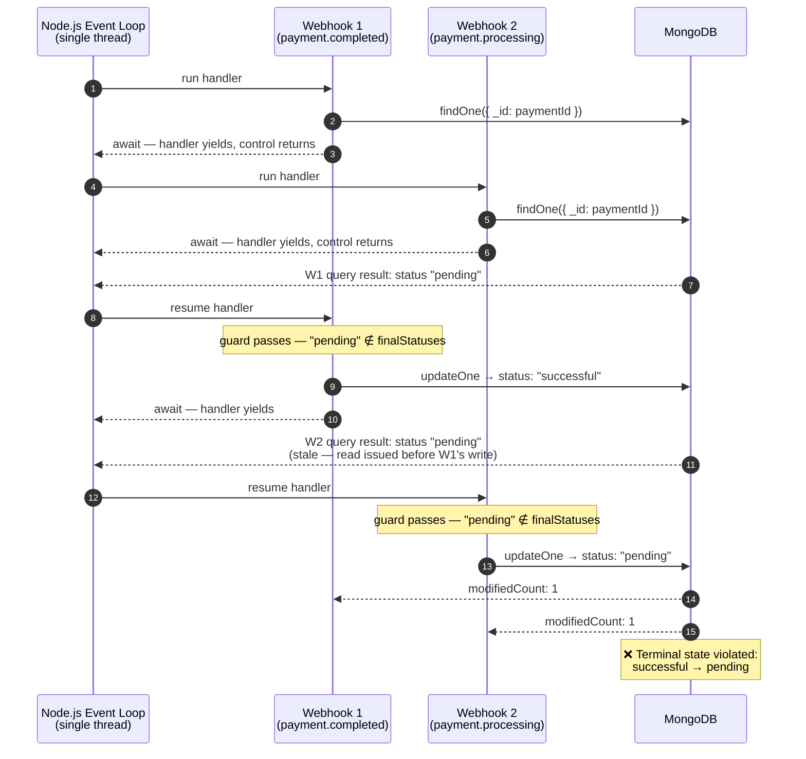
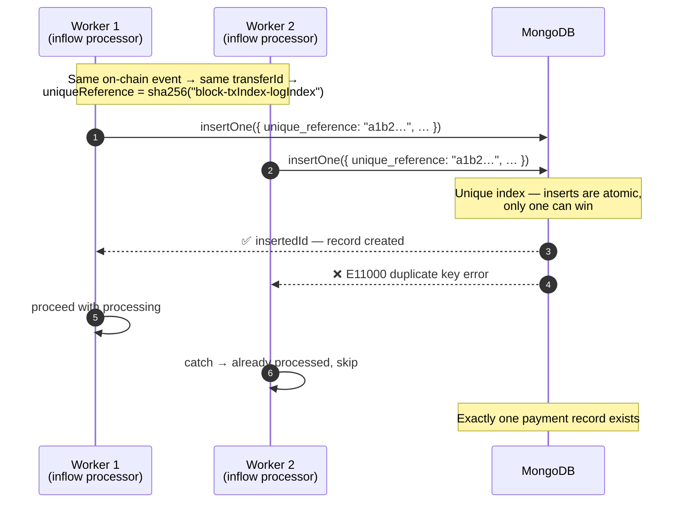
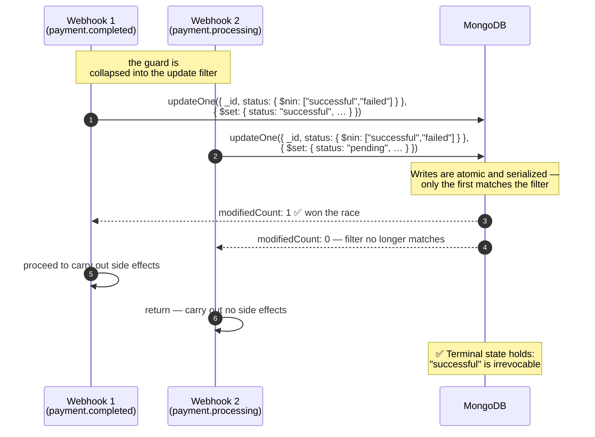

# Handling Race Conditions- MongoDB

Race conditions occur when multiple functions try to create or update the same resource concurrently. At Nuvion, we use MongoDB to handle data because, quite frankly, `payments` is not real. Different countries have different requirements for handling payments such that trying to model a schema that works for all countries is not feasible so we have to be
adaptive and flexible in our data model.

## Problem

How do we ensure our terminal states for payments are irrevocable? A `successful` payment should never be transitioned back to `pending` for example.
A naive approach that works for the most part would be something like:

```javascript
const payment = await cpnPaymentRepo.findOne({ query: { _id: paymentId } }); // compare
const cpnPaymentId = payment?.processing_details?.processor_reference;

if (!payment) {
  appLogger.warn({ paymentId, cpnPaymentId }, 'CPN-POLLING-PAYMENT-NOT-FOUND');
  return;
}

const finalStatuses = ['successful', 'failed'];
if (finalStatuses.includes(payment.status)) {
  return;
}

const internalStatus = mapStatus(cpnPayment.status, PAYMENT_STATUS_MAP);
const statusReason = notification?.failureReason || notificationType?.replace('cpn.payment.', '');
const start = payment.created || Date.now();
const retryAttempts = payment.processing_details?.retry_attempts || 0;

await cpnPaymentRepo.updateOne({
  // swap
  query: { _id: payment._id },
  updateValues: {
    status: internalStatus,
    status_reason: statusReason,
    'processing_details.last_polled_at': Date.now(),
    'processing_details.retry_attempts': retryAttempts + 1,
  },
});

// proceed to carry out side effects
```

This should work for the most part but remember that node.js is single-threaded (yeah I know I know, let's just go with this) and therefore if we have two concurrent webhooks, we have a problem. Webhook 1 will go to MongoDB to get the payment but that means the handler gets popped off the stack, allowing Webhook 2 to start processing. Webhook 2 goes to Mongo to query the payment and gets popped off the stack and so on. The problem is at the time they both went to the database, they got the same payment record so our guard here:

```js
const finalStatuses = ['successful', 'failed'];
if (finalStatuses.includes(payment.status)) {
  return;
}
```

is effectively the same for them. Now you have two webhooks for potentially different statuses both pass your status check and update the record. If they arrived out of order or for some reason (network latency, bandwidth, whatever) the payment completed webhook is processed first then we see that the other webhook will not know about this and will go on to transition the payment back to pending.



## Workarounds

Mongo writes are atomic so we have that going for us. What we need is a way to enforce this atomicity for our compare and swap i.e how do we make compare and swap one operation?

### 1. Unique Index

For inflows we can create a unique index on a collection and that solves the problem. Writes are atomic so only one worker can succeed
in creating a payment record; we do this when processing blockchain inflows:

```js
const transferId = `${log.blockNumber}-${log.transactionIndex}-${log.index}`;
const uniqueReference = crypto.createHash('sha256').update(transferId).digest('hex');
```

At this point we know that only one record with these unique properties will be created. For inflows from other providers we unfortunately have to trust that they will not send us notifications for the same payment with different references. Again `payments` not real.



### 2. Conditional Updates (Atomic Compare and Swap)

We can use conditional updates to ensure that only one worker can update the record at a time. We collapse the check and the update into one statement. HI AGAIN JIL 👋🏿

```js
const claim = await cpnPaymentRepo.updateOne({
  query: { _id: payment._id, status: { $nin: finalStatuses } },
  updateValues: {
    status: internalStatus,
    status_reason: statusReason,
    'processing_details.last_polled_at': Date.now(),
    'processing_details.retry_attempts': retryAttempts + 1,
    ...(internalStatus === 'successful' && {
      'processing_details.processing_time': Date.now() - start,
    }),
  },
});

if (claim.modifiedCount !== 1) {
  // ah worker lost the race, terminate. carry out no side effects
  return;
}

// worker won the race, carry out side effects
// process transaction
```



## Notes

This does not negate the need for the first read. For everyday use, the first read is still necessary to ensure the document exists and is not already marked terminal. It saves us API calls to the provider (a different can of worms but that's for another day) and trips to the database to update a record that may have already been processed.

Thanks to Jil who saved me from losing my sanity at some point. Spoke to Jil a few days before I worked on Circle Payments Network and we discussed the race condition problem. A few days later I discovered that race condition was trying to make me mad but again story for another day.

Thanks also to D3, he mentioned at one of our Money Flows calls (can we resume it please?) that Mongo writes were atomic and we should essentially leverage it to prevent crediting a customer twice for the same inflow if the provider sends us multiple webhooks for the same payment.
